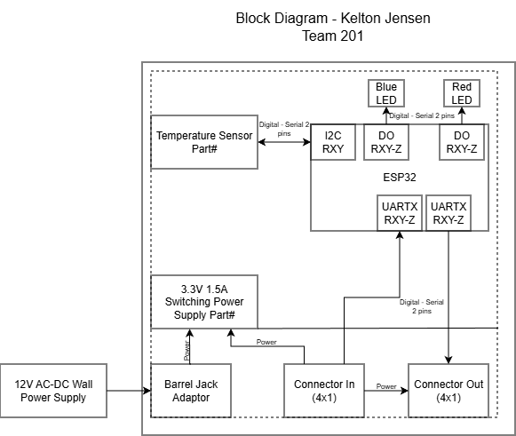

## Overview
Below is the block diagram for my subsystem for Team 201. My diagram contains an ESP32, a temperature sensor, and debugging LEDs. Information and power are distributed between team members in the daisy chain format. The board will receive power through a barrel jack or another team members board which is all regulated by a 3.3V power switching supply. The connectors have a wire decdicated for UART and unregulated power.

To get some initial formatting help, one can view ["here"](https://embedded-systems-design.github.io/EGR304DataSheetTemplate/Appendix/basic-markdown-examples/) some basic techniques.

## Example Block Diagram 
Showing an example of how to import a screenshot of the block diagram created outside of git and brought into a page.

A PDF of the block diagram can be viewed ["Here"](KJensen314.drawio.pdf)
