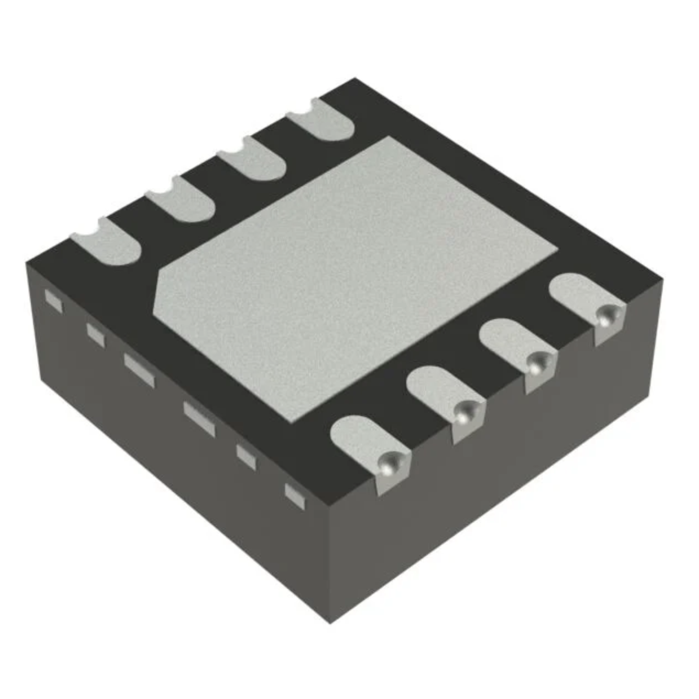
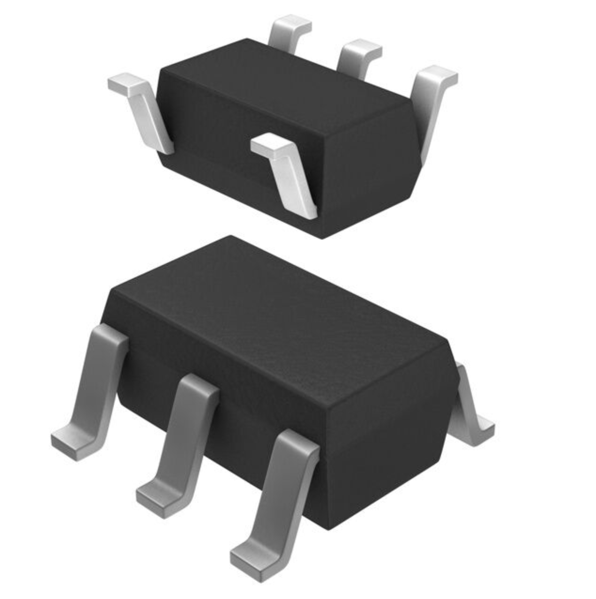
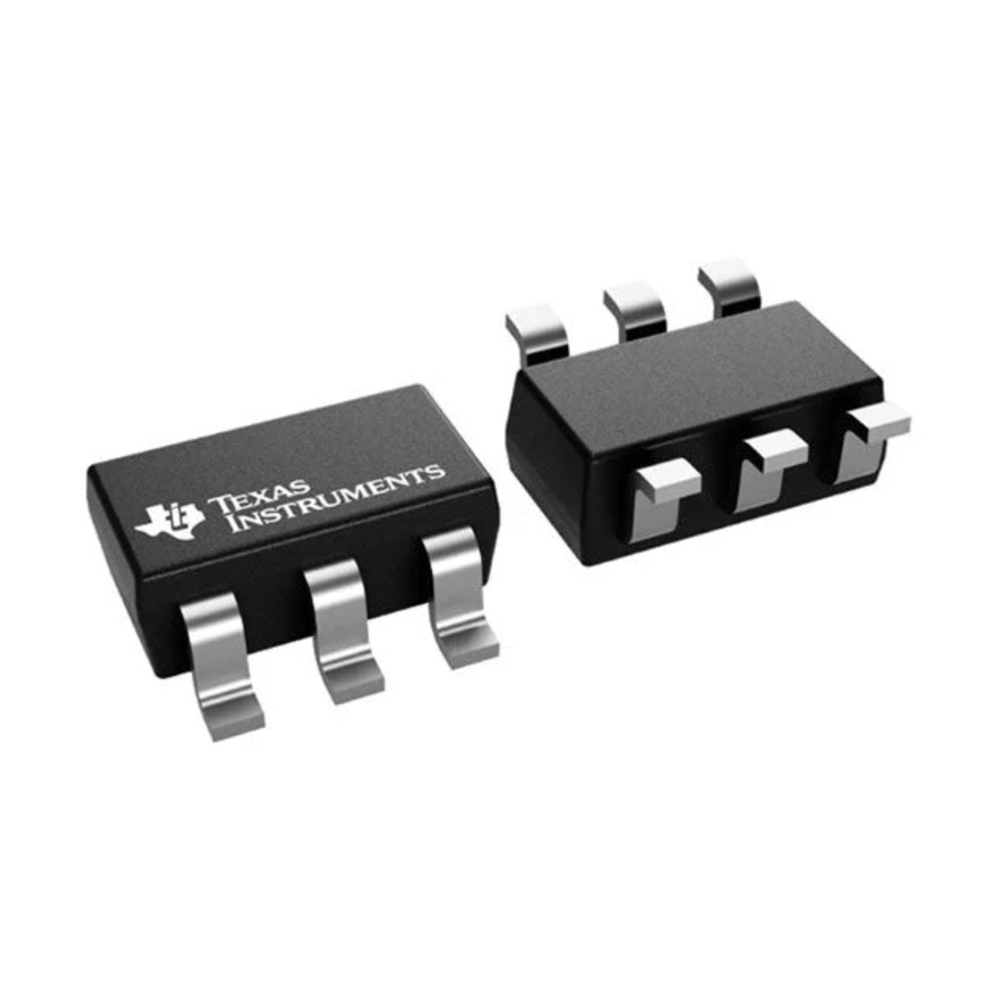
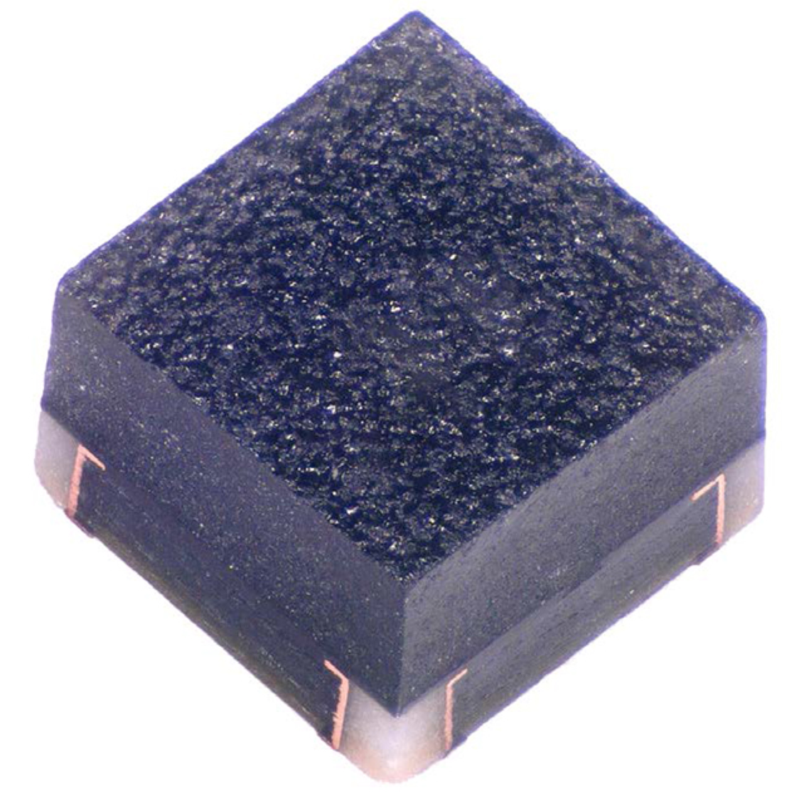
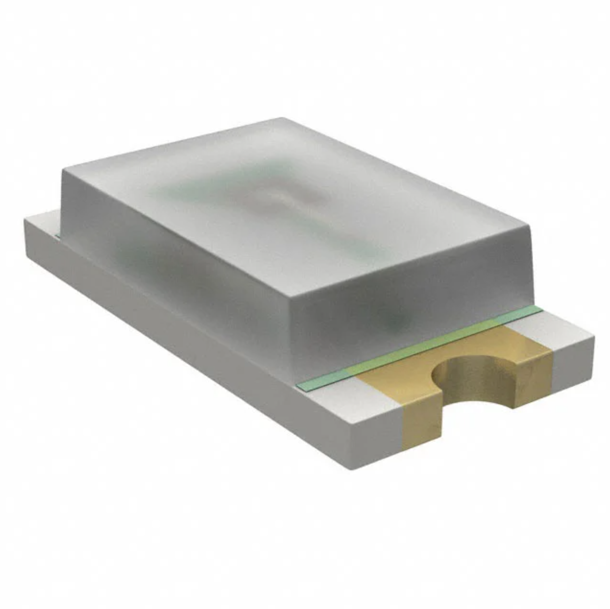

## Module's Selected Major Components

The following sections are the selected major components necessary for  .....

### Power Management

(**remove this note/placeholder**: this is where your 3.3 volt switching regulator, any other needed power regulator, and power source {if applicable} **THAT WERE SELECTED**)

For more details, review the ["Appendix - Component Selection Process - Power Mangement"](https://embedded-systems-design.github.io/EGR314DataSheetTemplate/Appendix/01-Componet-Selection/Component-Selection-Process/#power-management) selection.

### Sensor

(**remove this note/placeholder**: if applicable, this is where your  **SELECTED** sensor is shown. Otherwise, remove this section.)

For more details, review the ["Appendix - Component Selection Process - Sensor"](https://embedded-systems-design.github.io/EGR314DataSheetTemplate/Appendix/01-Componet-Selection/Component-Selection-Process/#sensor) selection.

-----------

**Temperature Sensor**

1. TMP1075DSGR

    

    * $0.46/each
    * [link to product](https://www.digikey.com/en/products/detail/texas-instruments/TMP1075DSGR/10715322)

    | Pros                                      | Cons                                                             |
    | ----------------------------------------- | ---------------------------------------------------------------- |
    | Inexpensive                               | Requires external components and support circuitry for interface |
    | Compatible with PSoC                      | Needs special PCB layout.                                        |
    | Meets surface mount constraint of project |

   2. TMP235A4DBZR

    

    * $0.36/each
    * [link to product](https://www.digikey.com/en/products/detail/texas-instruments/TMP235A4DBZR/9649794)

    | Pros                                      | Cons                                                             |
    | ----------------------------------------- | ---------------------------------------------------------------- |
    | Inexpensive                               | Requires external components and support circuitry for interface |
    | Compatible with PSoC                      | Needs special PCB layout.                                        |
    | Meets surface mount constraint of project |

   3. MCP9700T-E/LT

    

    * $0.40/each
    * [link to product](https://www.digikey.com/en/products/detail/microchip-technology/MCP9700T-E-LT/735965)

    | Pros                                      | Cons                                                             |
    | ----------------------------------------- | ---------------------------------------------------------------- |
    | Inexpensive                               | Requires external components and support circuitry for interface |
    | Compatible with PSoC                      | Needs special PCB layout.                                        |
    | Meets surface mount constraint of project |

**Rationale:** A clock oscillator is easier ...

---------------------

**3.3 Volt Switching Regulator**

1. SC189ZSKTRT

    

    * $0.86/each
    * [link to product](http://www.digikey.com/product-detail/en/ECS-40.3-S-5PX-TR/XC1259TR-ND/827366)

    | Pros                                      | Cons                                                             |
    | ----------------------------------------- | ---------------------------------------------------------------- |
    | Inexpensive                               | Requires external components and support circuitry for interface |
    | Compatible with PSoC                      | Needs special PCB layout.                                        |
    | Meets surface mount constraint of project |

   2. TLV61046ADBVR

    

    * $1.24/each
    * [link to product](http://www.digikey.com/product-detail/en/ECS-40.3-S-5PX-TR/XC1259TR-ND/827366)

    | Pros                                      | Cons                                                             |
    | ----------------------------------------- | ---------------------------------------------------------------- |
    | Inexpensive                               | Requires external components and support circuitry for interface |
    | Compatible with PSoC                      | Needs special PCB layout.                                        |
    | Meets surface mount constraint of project |

   3. AP63203WU-7

    

    * $0.71/each
    * [link to product](http://www.digikey.com/product-detail/en/ECS-40.3-S-5PX-TR/XC1259TR-ND/827366)

    | Pros                                      | Cons                                                             |
    | ----------------------------------------- | ---------------------------------------------------------------- |
    | Inexpensive                               | Requires external components and support circuitry for interface |
    | Compatible with PSoC                      | Needs special PCB layout.                                        |
    | Meets surface mount constraint of project |

**Rationale:** A clock oscillator is easier ...

---------------------

**LED**

1. LTST-C190KFKT

    

    * $0.86/each
    * [link to product](http://www.digikey.com/product-detail/en/ECS-40.3-S-5PX-TR/XC1259TR-ND/827366)

    | Pros                                      | Cons                                                             |
    | ----------------------------------------- | ---------------------------------------------------------------- |
    | Inexpensive                               | Requires external components and support circuitry for interface |
    | Compatible with PSoC                      | Needs special PCB layout.                                        |
    | Meets surface mount constraint of project |

   2. UHD111A-FKA-C3K23E1L3VG5ZB3Z3

    

    * $1.24/each
    * [link to product](http://www.digikey.com/product-detail/en/ECS-40.3-S-5PX-TR/XC1259TR-ND/827366)

    | Pros                                      | Cons                                                             |
    | ----------------------------------------- | ---------------------------------------------------------------- |
    | Inexpensive                               | Requires external components and support circuitry for interface |
    | Compatible with PSoC                      | Needs special PCB layout.                                        |
    | Meets surface mount constraint of project |

   3. SML-D12U1WT86

    

    * $0.71/each
    * [link to product](http://www.digikey.com/product-detail/en/ECS-40.3-S-5PX-TR/XC1259TR-ND/827366)

    | Pros                                      | Cons                                                             |
    | ----------------------------------------- | ---------------------------------------------------------------- |
    | Inexpensive                               | Requires external components and support circuitry for interface |
    | Compatible with PSoC                      | Needs special PCB layout.                                        |
    | Meets surface mount constraint of project |

**Rationale:** A clock oscillator is easier ...

---------------------------------

**Microcontroller Selection**

| ESP Info                                      | Answer | Help                                                                                                      |
| --------------------------------------------- | ------ | --------------------------------------------------------------------------------------------------------- |
| Model                                         | ?      | Include the entire part number (leave off any letters at the end that specify the package type)           |
| Product Page URL                              | ?      | Found on Espressif.com                                                                                    |
| ESP32-S3-WROOM-1-N4 Datasheet URL             | ?      | Do not paste links directly into the table.  Use a [link](#)                                              |
| ESP32 S3 Datasheet URL                        | ?      | Has more detail on functions                                                                              |
| ESP32 S3 Technical Reference Manual URL       | ?      | Has details on I/O multiplexing, USB, and others                                                          |
| Vendor link                                   | ?      | Digikey, Jameco, etc.  Do not paste links directly into the table.  Use a [link](#)                       |
| Code Examples                                 | ?      | url(s) for libraries on github or other sites related to the microcontroller and your planned peripherals |
| External Resources URL(s)                     | ?      | Search on Google and YouTube for other resources for each specific microcontroller.                       |
| Unit cost                                     | ?      | Find on Digikey, Jameco, MPJA, or octopart                                                                |
| Absolute Maximum Current for entire IC        | ?      | Find in the microcontroller datasheet                                                                     |
| Supply Voltage Range                          | ?      | Min / Nominal / Max / Absolute Max, as found in datasheet                                                 |
| Absolute Maximum current   (for entire IC) | ?      | as found in datasheet                                                                                     |
| Maximum GPIO current   (per pin)           | ?      | as found in datasheet                                                                                     |
| Supports External Interrupts?                 | ?      | as found in datasheet                                                                                     |
| Required Programming Hardware, Cost, URL      | ?      | as found in datasheet                                                                                     |

| Module         | # Available | Needed | Associated Pins (or * for any) |
| -------------- | ----------- | ------ | ------------------------------ |
| UART           | ?           | ?      | ?                              |
| external SPI\* | ?           | ?      | ?                              |
| I2C            | ?           | ?      | ?                              |
| GPIO           | ?           | ?      | ?                              |
| ADC            | ?           | ?      | ?                              |
| LED PWM        | ?           | ?      | ?                              |
| Motor PWM      | ?           | ?      | ?                              |
| USB Programmer | ?           | 1      | ?                              |
| ...            |

\* The ESP32-S2 has multiple SPI interfaces, but some are for internal use
